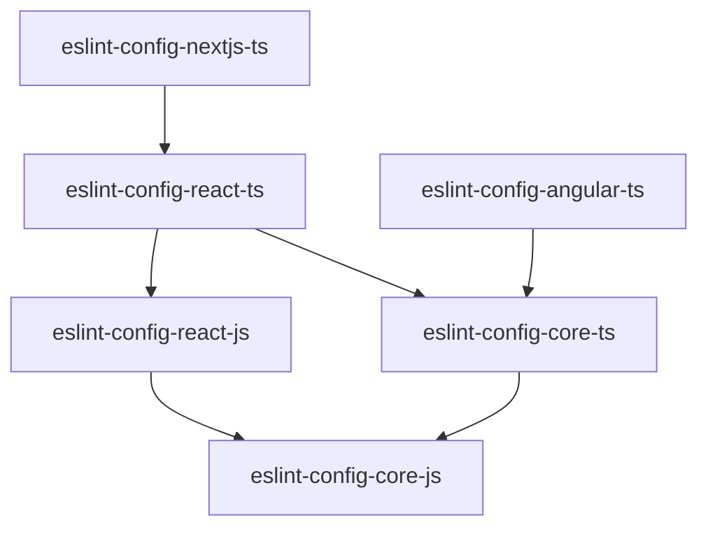

# Kickstage JS Linters

ESLint and TSLint configs

## ESLint package dependencies

## If you are adding a new package:

- Create a README.md file for the new package
- Run `npm install`
- Run `npx eslint --print-config .eslintrc` and check if the config is correct, especially if you are extending an existing package or adding an external config as a dependency (e.g. the external config might override your rules)

## License

The [MIT License](LICENSE)

## Credits

Maintained by
[Kickstage](https://kickstage.com).

