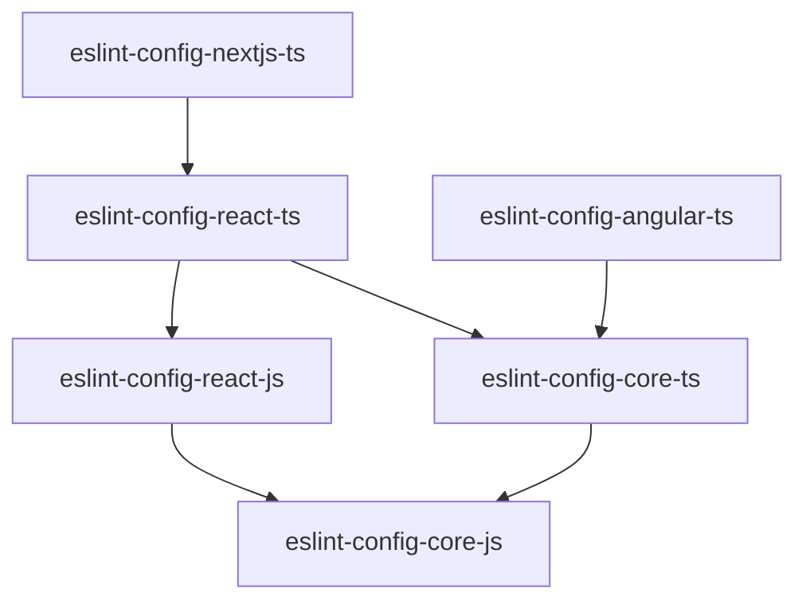

# Kickstage JS Linters

ESLint and TSLint configs

## ESLint package dependencies

```mermaid
graph TD;
    eslint-config-core-ts-->eslint-config-core-js;
    eslint-config-react-js-->eslint-config-core-js;
    eslint-config-react-ts-->eslint-config-react-js;
    eslint-config-react-ts-->eslint-config-core-ts;
    eslint-config-nextjs-ts-->eslint-config-react-ts;
    eslint-config-angular-ts-->eslint-config-core-ts;
```

## License

The [MIT License](LICENSE)

## Credits

Maintained by
[Kickstage](https://kickstage.com).

